# D3 - LoFi Prototype

This document is organized into two main sections, the UI Sketches, and the System Model Diagrams. Each section is further divided into sub-components, along with descriptive paragraphs.

# Section 1: UI Sketches

## Unauthenticated State:

This state shows when the user has not signed into the application. It is responsible for providing the users with an interface to create an account, or login to an existing account. Addtionally, a description and overview of the web application is provided to the users.

### <ins>_Landing Page_</ins>

<a href="./d3_assets/ui_sketches/unauth/landing.jpg">
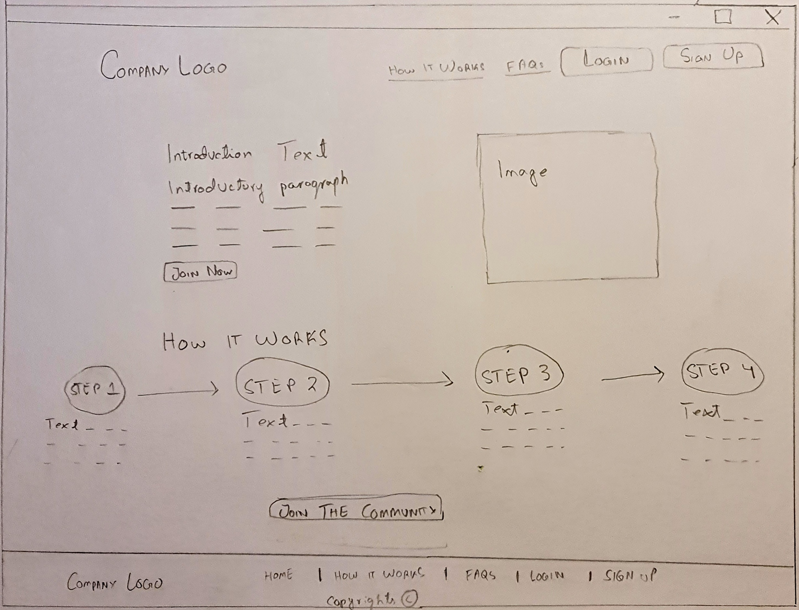
</a>

### <ins>_FAQs Page_</ins>

<a href="./d3_assets/ui_sketches/unauth/faqs.jpg">
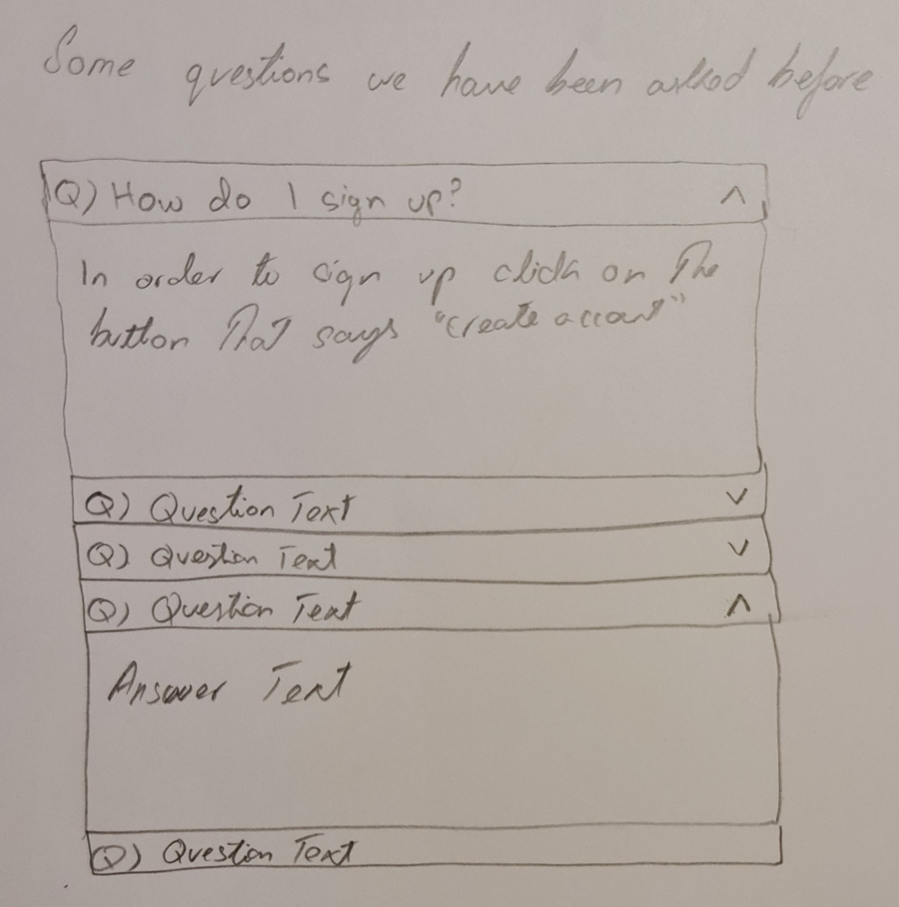
</a>

### <ins>_Login Modal_</ins>

<a href="./d3_assets/ui_sketches/unauth/loginModal.jpg">
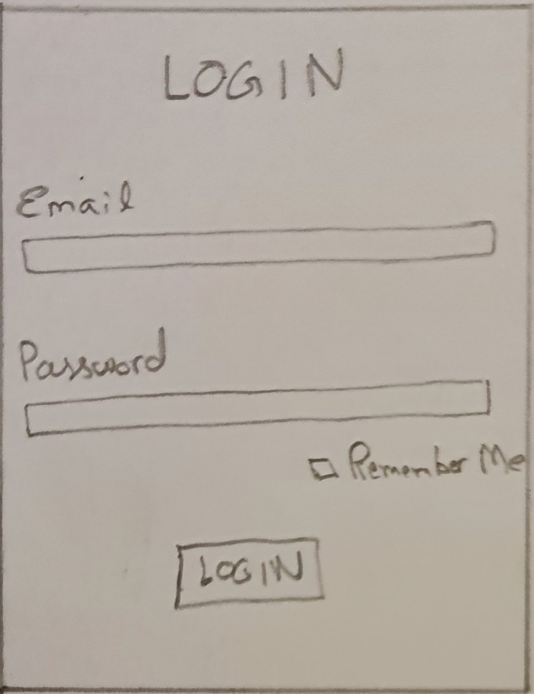
</a>

### <ins>_Signup Modal_</ins>

<a href="./d3_assets/ui_sketches/unauth/signupModal.jpg">
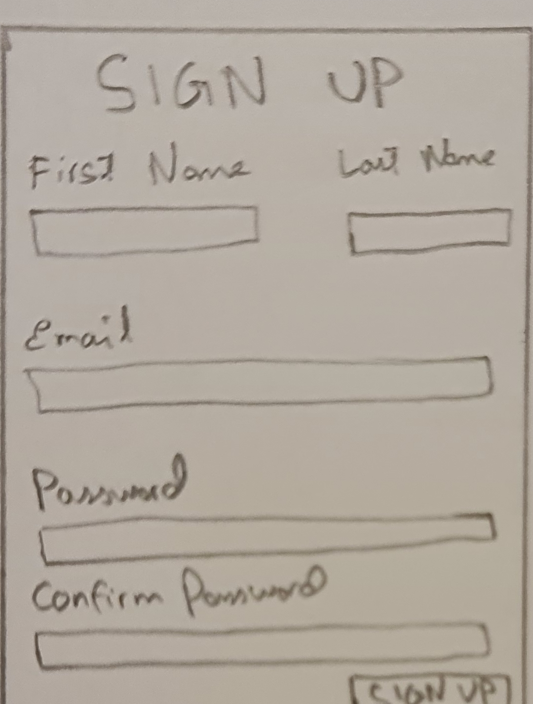
</a>

## Authenticated State:

When the user has logged in, the toggle at the top will be used to switch between a helper and a helpee. The UI for both of the roles is the same except for some textual changes. Therefore, the UI sketches of only the helpee is shown below.

### <ins>_Profile Modal & Page_</ins>

Profile Modal:  
<a href="./d3_assets/ui_sketches/auth/profile/profile_modal.jpg">
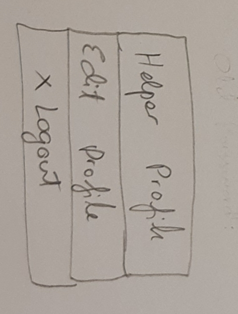
</a>

Helper Profile Page:  
<a href="./d3_assets/ui_sketches/auth/profile/profile_helper.jpg">
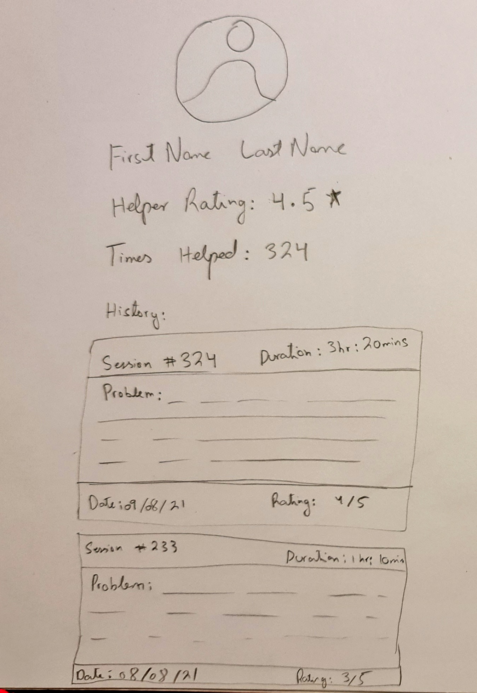
</a>

Edit Profile Page:  
<a href="./d3_assets/ui_sketches/auth/profile/profile_edit.jpg">
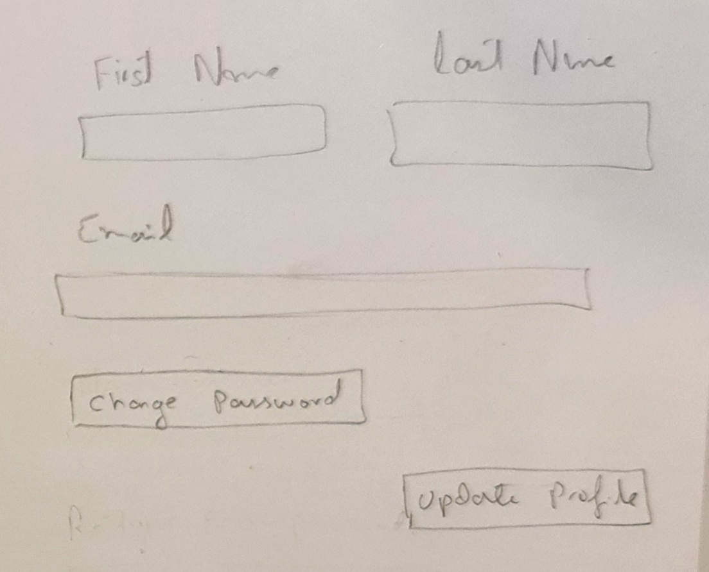
</a>

### <ins>_User status = "idle"_</ins>

This is when the user is not currently waiting for a match, or has been placed into a chatroom. The images below show what the user would see the first time they log into the app.

Step 1: Select Technology:  
<a href="./d3_assets/ui_sketches/auth/idle/idle_step1.jpg">
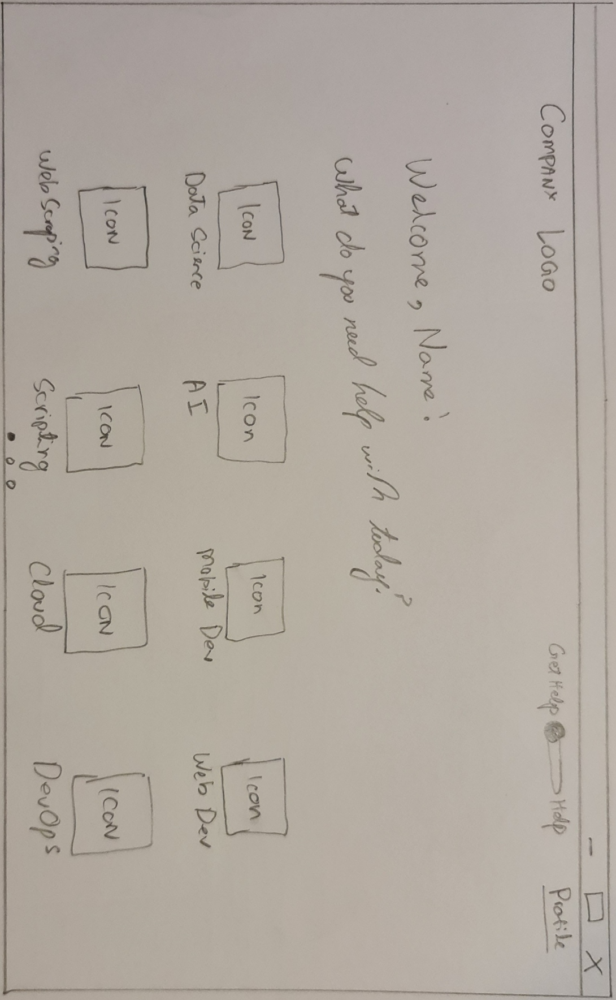
</a>

Step 2: Select Language:  
<a href="./d3_assets/ui_sketches/auth/idle/idle_step2.jpg">
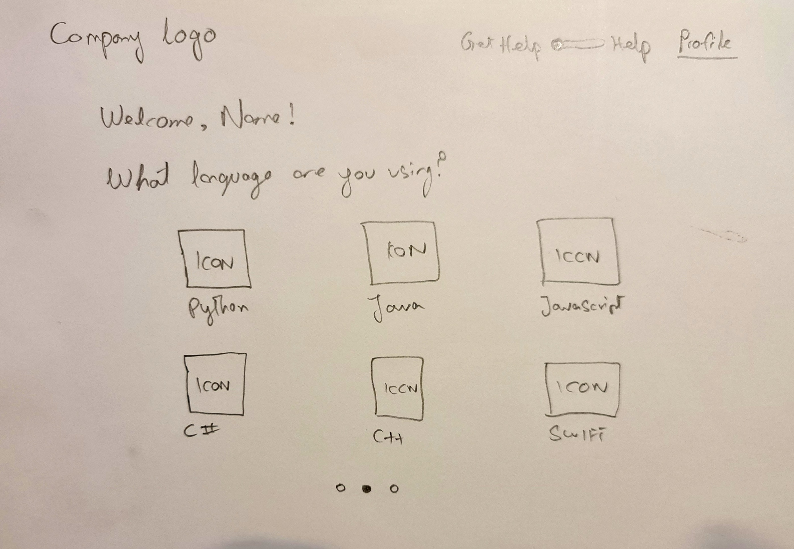
</a>

Step 3: Describe Problem Statement:  
<a href="./d3_assets/ui_sketches/auth/idle/idle_step3.jpg">
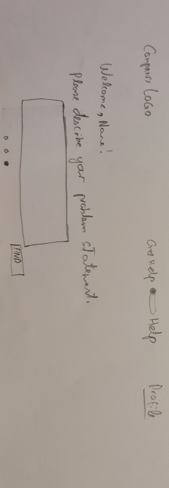
</a>

### <ins>_User status = "waiting"_</ins>

<a href="./d3_assets/ui_sketches/auth/waiting/waiting.jpg">
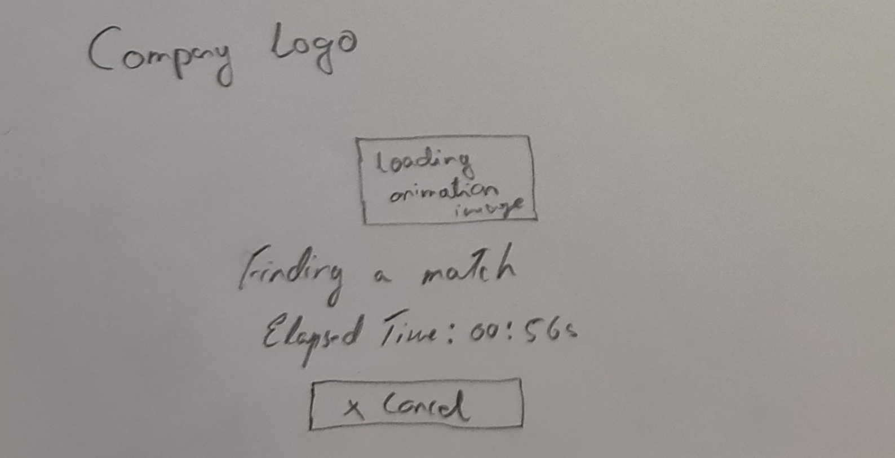
</a>

### <ins>_User status = "matched"_</ins>

Step 1: Chat Room  
<a href="./d3_assets/ui_sketches/auth/matched/matched_step1.jpg">
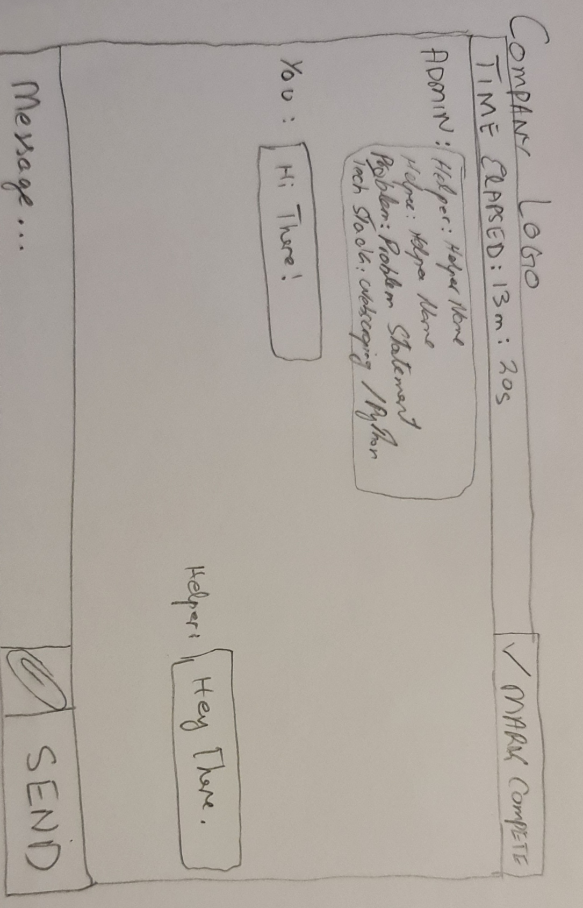
</a>

Step 2: Leave Feedback  
<a href="./d3_assets/ui_sketches/auth/matched/matched_step2.jpg">
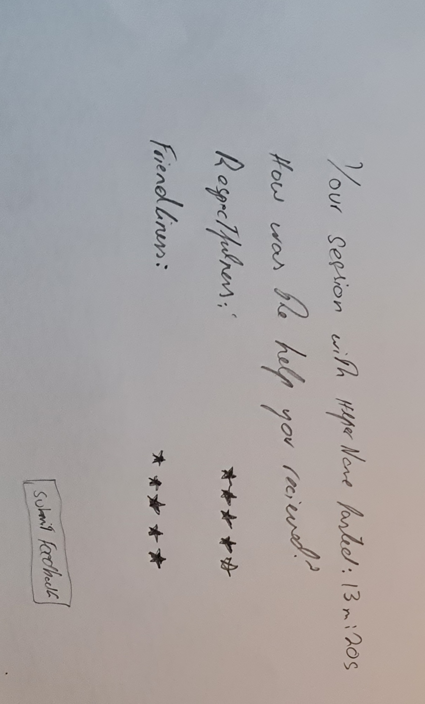
</a>

# Section 2: System Model Diagrams
