# Section 1: Proof of Concept

To demonstrate the proof of concept, two separate entities are created, the frontend in React and the backend in Node JS. Following the creation, a connection is established between the two to ensure the transfer of data.

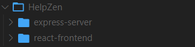  
_Project structure for frontend and backend._
  

## React Frontend

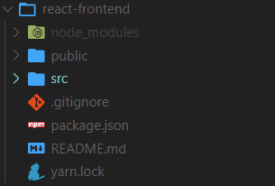 
_Project structure for frontend_
  

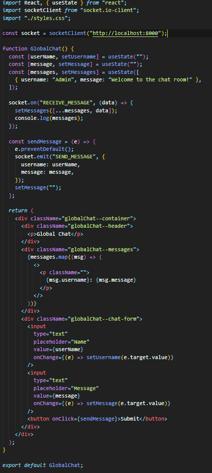 
_Code for connecting to the server, and updating the data on the UI_
  

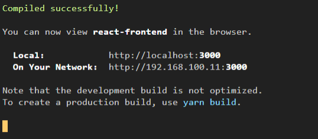 
_Running the react frontend on localhost using command prompt_
  

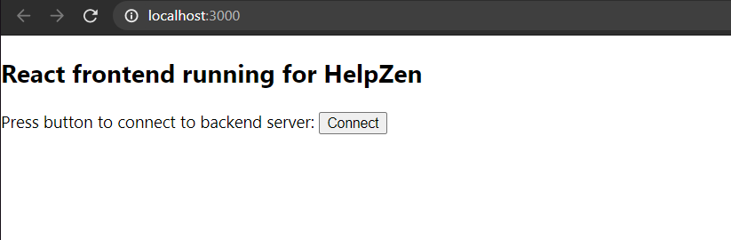 
_Result of the code in the screenshot above. Clicking the connect button tries to establish a connection with the server._
  

## NodeJS Backend

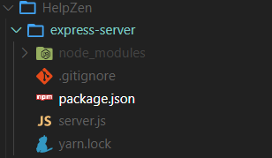 
_Project structure for server_
  

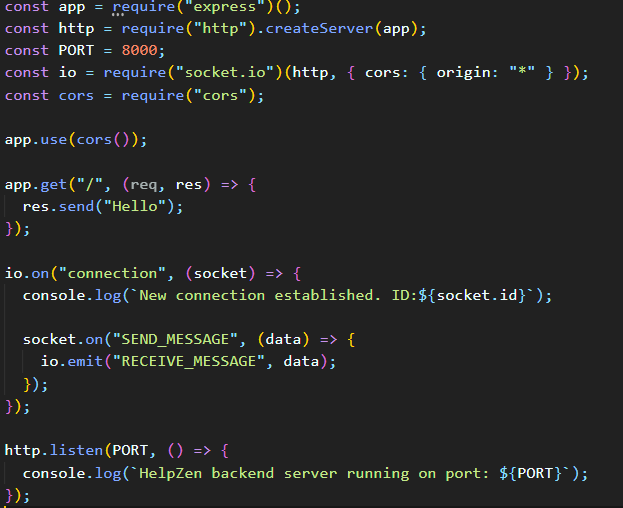 
_Code for starting up the server and returning a default message_
  

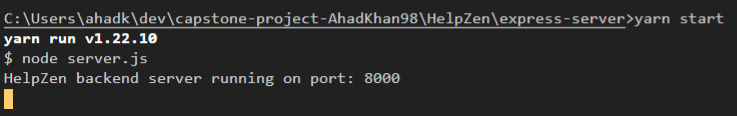 
_Starting up the server on localhost using a command prompt_
  

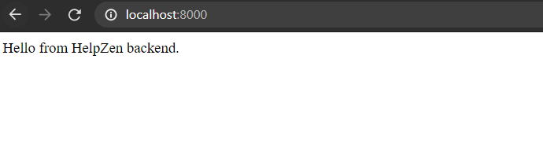 
_Viewing server in the browser_
  

## Communication Between The Two

## Success

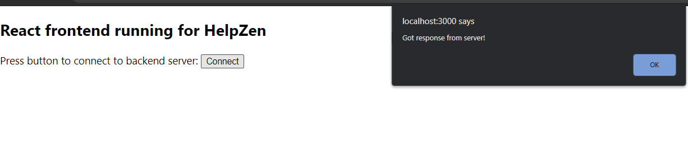 
_Alerting the user when the server is running and returning responses successfully._
  

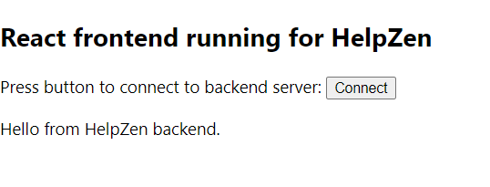 
_Showing the message received by the server on the user interface._
  

## Failure

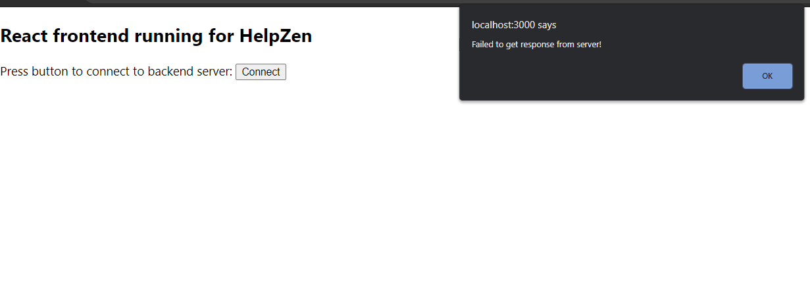 
_Alerting the user when the server is either not running or failed to return a valid response._
  

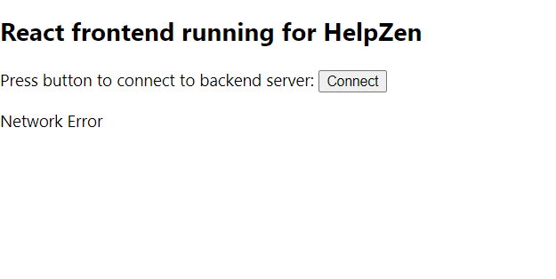 
_Showing the error message on the user interface._
  

# Section 2: Concept Documentation

## Requirements

In order to run the code contained in this project, you need to have NodeJS installed on your system. This will allow you to install other JavaScript dependencies that the project uses. Additionally, you need to install Yarn which is a package manager that this project uses.

Dependencies:

- React
- Express
- Cors
- Nodemon
- Axios

## Instructions

The first and the most important step is to install NodeJS and Yarn on your system.  
To get started, visit the official website for NodeJS: [Offical Website](https://nodejs.org/en/) and follow the steps to install NodeJS on your system.  
To check if your installation was successful, run the following command in the command prompt: `node -v`. If you see a version, you have successfully installed NodeJS on your system.

The next step is to install Yarn (package manager) to easily install all the dependencies that the project contains later on. To get started, open up a command prompt window and type the following command: `npm install --global yarn`. Once again, to verify the installation, type the following command: `yarn --version`. If you see a version, you have successfully installed yarn.

Now, clone the repo and follow the instructions below to start up the server and the frontend.

**Starting the Server**

1. Move into the following directory: `HelpZen/express-server`
2. Run the following command to install dependencies: `yarn install`
3. Run the following command to start the server: `yarn start`
4. To view the server visit http://localhost:8000/ on your browser.

**Starting the Frontend**

1. Move into the following directory: `HelpZen/react-frontend`
2. Run the following command to install dependencies: `yarn install`
3. Run the following command to start the server: `yarn start`
4. Your browser should open up automatically with the user interface displayed on it.

## Functionality

# Section 3: Updates

# Section 4: Reflection
