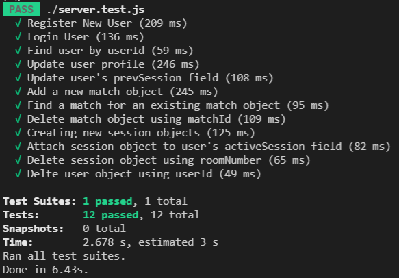

# Overview

In order to test the complete web-application, I decided to use a two step approach. Since the backend and the frontend can function independently, I decided to use unit testing for the backend to test for routes and test the response for varying forms of input. And for the front-end I went with a cognitive walkthrough approach where my application was put infront of 3 different people, and their interactions were recorded.

# Testing The Backend: Unit Testing

The backend API uses several end points that send data back. This data can indicate whether a successful request was made or not. Therefore, unit testing each of these endpoints is a strategy that I used to test each of these routes. The test cases send data that is expected to fail, and also data that is expected to succeed. The data returned is then tested against the expected results.

Following were the results from running the different test cases:

# Testing The Frontend: Cognitive Walkthrough

Since the web-application has a bunch of different features that the user can engage in, using a cognitive walkthrough would be suitable in order to identify how users interact with the system and whether it confuses them or not.

The users were asked to perform the tasks below in order. Instrucions on how to achieve the tasks are also given below.

1. Task # 1: Register for a new account  
   **Instructions:** _The user should click on the button that says "Register" on the top right side of the page. Then the user should fill out the form with their information and press the "Sign Up" button._

2. Task # 2: Ask for help in "web development" and "javascript"  
   **Instructions:** _The user should make sure that the toggle button is pointing towards "Get Help". After that the user should click on the icon that says "Web Development". On the next screen, the user should select the icon for "javascript" and proceed to fill out the problem statement._

3. Task # 3: Send any message to the person that you got matched with  
   **Instructions:** _The user should click on the empty textbox at the bottom of the screen and type a message. After that the user should either press the "Send" button or press the "Enter" key and the message will be sent._

4. Task # 4: End the session with the matched user  
   **Instructions:** _The user should simply press the red button on the top right side of the screen that says "End Session". This will cause the session to immediately end._

5. Task # 5: Rate the previous session  
   **Instructions:** _The user should select the number of stars that they think the previous session should deserve. After making a selection, they should simply press the submit button._

6. Task # 6: Offer help in "web development" and "javascript"  
   **Instructions:** _At this point if the user performed the previous steps successfuly, the user would be at the home screen. From here the user needs to toggle the switch to "Offer Help" and proceed to making the selections on "Web Development" and "JavaScript". Once the loading bar is displayed, the task is complete._

7. Task # 7: View your helper stats  
   **Instructions:** _The user should press the box on the top right that has their name on it. This will open up a drop down menu from which the "Helper Stats" option should be selected. Once the selection is made, the user's previous help sessions will be shown._

8. Task # 8: Change your email address to something else  
   **Instructions:** _The user should press the box on the top right that has their name on it. This will open up a drop down menu from which the "Edit Profile" option should be selected. Once the selection is made, the user needs to enter a new email address in the field and not enter any other information. Press the update button next._

9. Task # 9: Logout of the system  
   **Instructions:** _The user should press the box on the top right that has their name on it. This will open up a drop down menu from which the "Logout" option should be selected. Thepage will reload and the user will not be logged in anymore._

10. Task # 10: Log back in  
    **Instructions:** _The user should press the button on the top-right panel that says "Login". The user should then enter the e-mail and password that they used previously to register with the system. If all goes well, the user will get logged back into the system._

Following are the observations and the results from the three users that used the platform.

## User 1

**Task # 1**  
Observations: Scrolled around the webpage and proceed to click the register button on the top right. The user filled out the information correctly and was able to sign up.  
Result: Passed ✅

**Task # 2**  
Observations: User clicked on the icon that says "web development" and procced to click the icon labelled "javascript". A random description and problem statement was also entered.  
Result: Passed ✅

**Task # 3**  
Observations: The user was quick to recognize the textbox used to send messages and pressed the "Enter" key on the keyboard. The message was sent successfully.  
Result: Passed ✅

**Task # 4**  
Observations: The user pressed the "end session" button and the session ended correctly.  
Result: Passed ✅

**Task # 5**  
Observations: The user was able to identify the ability to choose between stars and was able to select and submit a rating.  
Result: Passed ✅

**Task # 6**  
Observations: The user did not switch the toggle to "offer help" and tried to continue making selections as they did earlier.  
Result: Failed ❌

**Task # 7**  
Observations: The user had some trouble finding the "helper stats" link. They looked around the website for some hints. Eventually, they were able to select the drop down and view their helper stats.  
Result: Passed ✅

**Task # 8**  
Observations: The user successfuly went to the edit profile page and change their e-mail address to something else.  
Result: Passed ✅

**Task # 9**  
Observations: The user was able to find the logout button from the dropdown menu and was able to log out of the system.  
Result: Passed ✅

**Task # 10**  
Observations: The user was quick to identify the login button and was able to login to the system with their previously created account.  
Result: Passed ✅

## User 2

**Task # 1**  
Observations: The user quickly clicked the register button on the top right. The user filled out the information correctly and was able to sign up.  
Result: Passed ✅

**Task # 2**  
Observations: User clicked on the icon that says "web development" and procced to click the icon labelled "javascript". A random description and problem statement was also entered.  
Result: Passed ✅

**Task # 3**  
Observations: The user was quick to recognize the textbox used to send messages and pressed the "Enter" key on the keyboard. The message was sent successfully.  
Result: Passed ✅

**Task # 4**  
Observations: The user closed the window in order to close the session. The chat session was not ended initially.
Result: Failed ❌

**Task # 5**  
Observations: The user was able to identify the ability to choose between stars and was able to select and submit a rating.  
Result: Passed ✅

**Task # 6**  
Observations: The user was able to toggle the switch to "offer help" and continued making selections as they did earlier.  
Result: Passed ✅

**Task # 7**  
Observations: They were able to select the drop down and view their helper stats.  
Result: Passed ✅

**Task # 8**  
Observations: The user successfuly went to the edit profile page and change their e-mail address to something else.  
Result: Passed ✅

**Task # 9**  
Observations: The user was able to find the logout button from the dropdown menu and was able to log out of the system.  
Result: Passed ✅

**Task # 10**  
Observations: The user was quick to identify the login button and was able to login to the system with their previously created account.  
Result: Passed ✅

## User 3

**Task # 1**  
Observations: The user clicked the register button on the top right. The user filled out the information correctly and was able to sign up.  
Result: Passed ✅

**Task # 2**  
Observations: User clicked on the icon that says "web development" and procced to click the icon labelled "javascript". A random description and problem statement was also entered.  
Result: Passed ✅

**Task # 3**  
Observations: The user was quick to recognize the textbox used to send messages and pressed the "Enter" key on the keyboard. The message was sent successfully.  
Result: Passed ✅

**Task # 4**  
Observations: The user pressed the "end session" button and the session ended correctly.  
Result: Passed ✅

**Task # 5**  
Observations: The user was able to identify the ability to choose between stars and was able to select and submit a rating.  
Result: Passed ✅

**Task # 6**  
Observations: The user was able to switch the toggle to "offer help" continued making selections as they did earlier.  
Result: Passed ✅

**Task # 7**  
Observations: The user was unable to find the helper stats icon. They did not know that clicking the box on the top right would show more options.
Result: Failed ❌

**Task # 8**  
Observations: The user was unable to select the edit profile page. They did not know that clicking the box on the top right would show more options.  
Result: Failed ❌

**Task # 9**  
Observations: The user was able to logout using the link in the footer.
Result: Passed ✅

**Task # 10**  
Observations: The user was able to identify the login button and was able to login to the system with their previously created account.  
Result: Passed ✅

# Final Results

The results for the backend testing were perfect. All of the tests passed and the expected data is being returned for all endpoints.

The results for the frontend testing were good for the most part. The observations found that there might be some elements in the UI that are hard to make sense out of, and might not be self-explanatory. Perhaps, guiding the user along the process would solve this issue.
